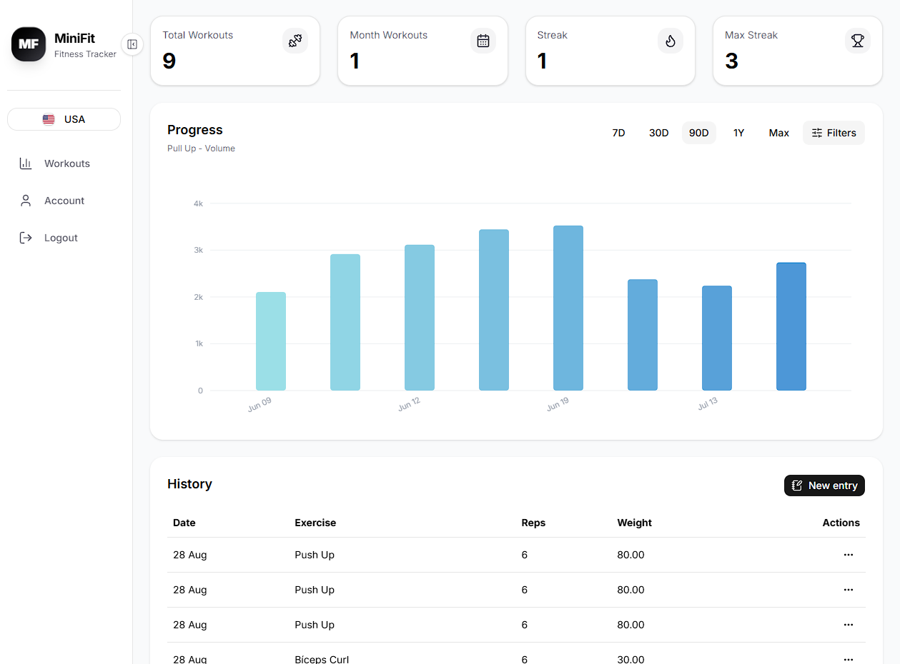

# MiniFit

A full-stack fitness tracker for logging workouts and visualizing training progress. Users can create verified accounts, add exercise entries with date, reps, and weight, review workout history, filter progress charts, and manage account security through email verification and password reset flows.

## Screenshots

<!-- Add screenshots at frontend/public/images/screenshot1.png and frontend/public/images/screenshot2.png -->

<div align="center">
  <p float="left">
    
  </p>
</div>

## Setup Instructions

```bash
git clone https://github.com/vfb-dev/mini-fit.git
cd mini-fit
```

### Backend

```bash
cd backend

python -m venv env
env\Scripts\activate

pip install -r requirements.txt
```

Create a `.env` file in the `backend` folder:

```env
SECRET_KEY=your-secret-key
DEBUG=True

DB_NAME=mini_fit
DB_USER=postgres
DB_PASSWORD=your-database-password
DB_HOST=localhost

ALLOWED_HOSTS=localhost,127.0.0.1
CORS_ALLOWED_ORIGINS=http://localhost:3000
CSRF_TRUSTED_ORIGINS=http://localhost:3000

EMAIL_HOST_USER=your-email@gmail.com
EMAIL_HOST_PASSWORD=your-email-app-password

APP_NAME=MiniFit
FRONTEND_URL=http://localhost:3000
SUPPORT_EMAIL=your-email@gmail.com
```

Run the backend:

```bash
python manage.py migrate
python manage.py createsuperuser
python manage.py runserver
```

### Frontend

```bash
cd ../frontend

npm install
npm run dev
```

The frontend uses `http://localhost:8000` as the default API URL. To override it, create a `.env.local` file in the `frontend` folder:

```env
NEXT_PUBLIC_API_URL=http://localhost:8000
```

Open `http://localhost:3000` in your browser.

## Author

vfb-dev - Turning ideas into web apps
